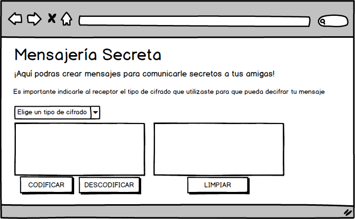
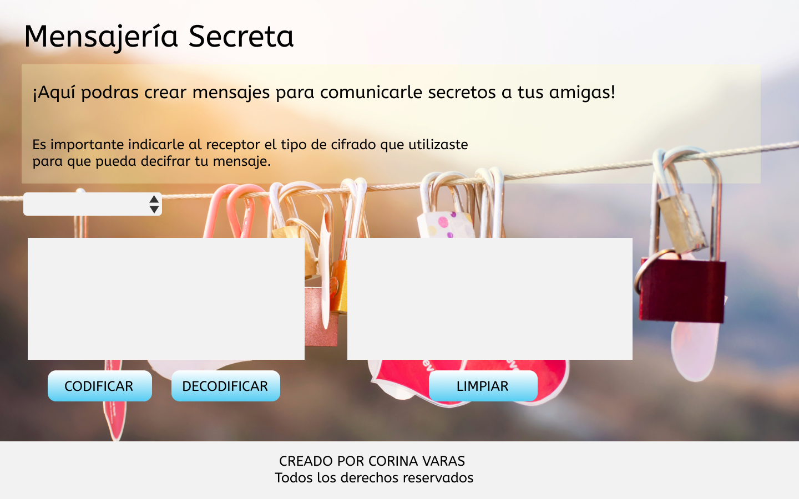

# Mensajería Secreta 

Es una aplicación web, está diseñada y pensada especialmente para usuarios que tengan la necesidad de comunicar un mensaje de forma secreta.
Fue creada con el propósito de generar un sitio web donde puedas crear una comunicación totalmente segura sin riegos de que la comunicación pueda ser divulgada o vista por personas ajenas a ella. 

Los principales usuarios a los que esta destinado este producto es a la generación Millennials, es decir a  los nacidos entre 1981 y 1999, que actualmente tienen una edad comprendida entre 16 y 36 años. 

El objetivo principal del usuario en este producto es poder generar un mensaje de manera efectiva, cumpliendo con el objetivo general del sitio siendo este transmitido de forma secreta.

## Diseño-UX

Principalmente se creó con un diseño básico, con colores neutros y pasteles dedicado a un público femenino. 

## Testeos de usabilidad con usuarios reales

Se realizaron pruebas unitarias en usuarios reales. Los cuales tuvieron la oportunidad de acceder a la página web e interactuar en ella, ahí surguío una nueva necesidad de realizar cambios al prototipo con la finalidad de crear un producto mas amigable con el usuario 

## - Sketch con Balsamiq

## - Prototipo de Alta fidelidad 

 ## Interfaz de Usuario (UI)
- La interfaz le permite al usuario elegir un nivel de seguridad 

- Insertar un mensaje (texto) que queremos codificar.
- Ver el resultado del mensaje codificado.

- Insertar un mensaje (texto) a decodificar.
- Ver el resultado del mensaje decodificado.

## Consideraciones Generales

Es importante que el receptor del mensaje sepa por cual canal estas codificando tu mensaje para que ella lo pueda decodificar por el mismo canal

Está desarrollado a traves de un tipo de cifrado por desplazamientos, llamado codigo César, denominado así en honor al emperador romano Julio César quién lo usaba para enviar órdenes secretas a sus generales, actualmente es una de los cifrados mas conocidos.

Su funcionamiento en si deriva de la sustitucion de una letra del texto original siendo esta reemplazada por otra letra asociada a un numero fijo de posiciones de desplazamientos. Este tipo de cifrado no ofrece mucha seguridad ya que se descifra con mucha facilidad.

 # RESUMEN 

Finalmente esta aplicacion web nos servirá para enviar mensajes cifrados a cualquier persona y de este manera poder mantener una conversacion protegida. 

 ## Pre-requisitos Test 📋

- Instalación de NODEJS v12.10.0
- Ejecutar npm install para instalar las dependencias 
- npm test

## Construido con 🛠️

- JavaScript (ES6)
- Vanilla JS 
- HyperText Markup Language (HTML)
- Cascading Style Sheets (CSS)

#### EXPRESIONES DE GRATIFICACION 🎁

Doy gracias a Dios

Mi maravilloso squad 

A las Coachs de Laboratoria <💛>